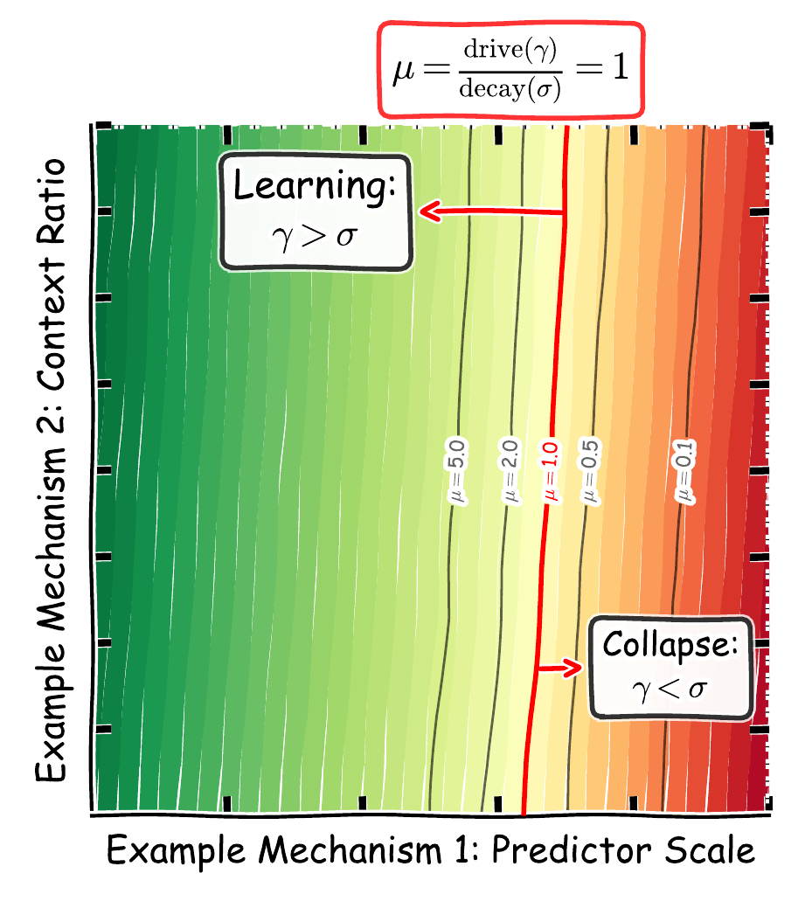
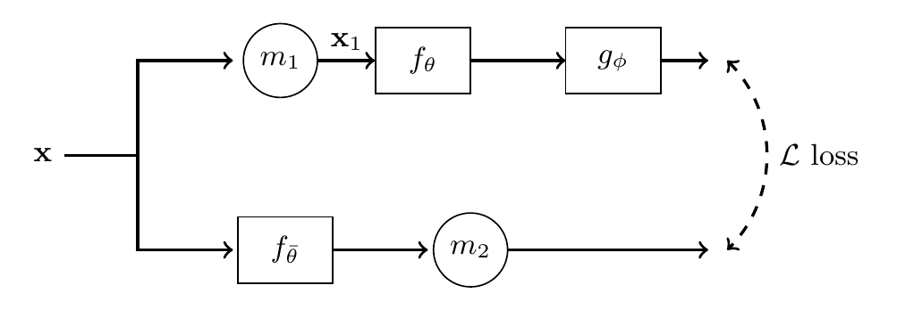
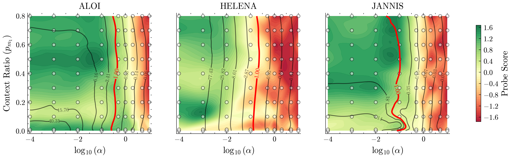

<div align="center">
<h1>Drive vs. Decay: On the Training Dynamics of<br>Joint-Embedding Predictive Architectures</h1>
<p><b>José Lucas De Melo Costa · Seong Woo Ahn · Fabrice Popineau · Arpad Rimmel · Bich-Liên Doan</b></p>
<p>Université Paris-Saclay, CNRS, CentraleSupélec, LISN, Orsay, France</p>
<p>
  
  
  
  
</p>
 1), collapse where the decay wins (mu < 1)">
<p><sub><b>Figure 1 of the paper.</b> Phase boundary. Learning where the drive wins (μ = γ/σ > 1), collapse where the decay wins (μ &lt; 1).</sub></p>
</div>

<details>
<summary><b>Abstract</b></summary>

Joint-Embedding Predictive Architectures (JEPAs) are prone to representation collapse, typically mitigated
through empirical heuristics. We develop an early-training stability theory that unifies these heuristics.
Linearising the coupled JEPA gradient flow around the trivial fixed point reveals two competing effects: a
driving force ($\gamma$) and a decay effect ($\sigma$). Under approximate spectral decoupling, a per-mode
stability ratio $\mu_i = \gamma_i / \sigma_i$ factorises into independent data-side and predictor-side terms
and the count of unstable modes tracks the rank of representations that can emerge. The framework predicts a
phase boundary, which we confirm empirically across more than 800 Tabular-JEPA configurations. It also
unifies predictor scaling, masking ratio, and EMA as distinct mechanisms for shifting $\mu$. Guided by this
analysis, we introduce ResidualPred, a transformer predictor whose attention is biased toward the identity at
initialisation; it improves both effective rank and downstream accuracy on tabular benchmarks and in I-JEPA
pretraining on CIFAR-10, CIFAR-100, STL-10, and ImageNet. Our framework connects empirical collapse-avoidance
heuristics to an explicit dynamical picture, yielding theory-driven stabilizers.

</details>

## Repository

```
tabular/   Tabular-JEPA and T-JEPA (MIT)
image/     I-JEPA (CC BY-NC 4.0)
results/   per-run outputs of the paper's experiments
```

## Installation

```bash
pip install torch torchvision        # the build matching your CUDA
pip install -r requirements.txt
bash test.sh                         # smoke test, a few minutes on one GPU
```

## Method

<p align="center">
  
  <br><sub><b>Figure 2 of the paper.</b> Linear JEPA architecture.</sub>
</p>

| predictor | flag |
|---|---|
| Standard (I-JEPA / T-JEPA) | `--predictor_type standard` |
| **ResidualPred** | `--predictor_type residualpred` |
| ZeroInit only (App. E) | `--predictor_type residualpred --beta_init 0` |
| ResidualPred (bias only) (App. E) | `--predictor_type residualpred --no_zero_init` |
| ResidualPred frozen at initialisation (App. I.8) | `--predictor_type frozen_rp` |
| skip-only predictor (App. I.8) | `--predictor_type skiponly` |
| mimetic initialisation (App. I.9) | `--predictor_type mimetic` |
| + SIGReg (App. I.9) | `--sigreg_lambda 0.05` |
| + VICReg (App. I.9) | `--vicreg_var_weight 1.0 --vicreg_cov_weight 0.04` |

These flags apply to `image/`; on tabular data, ResidualPred is `experiment_2.py --use_residual_predictor`.

## Reproducing the paper

```bash
bash reproduce.sh --list              # every experiment
bash reproduce.sh in1k-pilot --show   # its commands
bash reproduce.sh in1k-pilot --cell 3 # one run (SLURM arrays: LAUNCH=srun)
```

| paper | experiment | hardware |
|---|---|---|
| Fig. 4, Tables 12 to 17 | `phase-grid-aloi`, `phase-grid-helena`, `phase-grid-jannis` | 1 GPU |
| Table 4 (tabular), Tables 18 and 19 | `tabular-residualpred` | 1 GPU |
| Table 4 (image), Tables 9, 20 and 21 | `cifar10`, `cifar100`, `stl10` | 1 GPU |
| Fig. 6b, Table 9 | `cifar100-300ep` | 1 GPU |
| Table 4 (IN-100), App. I.6 | `in100`, `in100-vitb` | 1 H100 |
| §6.2, App. I.8 | `in100-controls` | 1 H100 |
| Fig. 6c, App. I.7 | `in1k-pilot`, `in1k-224px`, `in1k-90ep` | 4 H100 |
| Table 5, App. I.9 | `in1k-sigreg`, `in1k-vicreg`, `in1k-mimetic` | 4 H100 |

kNN and attentive probes from a saved checkpoint:

```bash
cd image && python eval_probes.py --ckpt <run>-latest.pth.tar --data_root data/imagenet \
    --out probes.json --num_classes 1000 --max_per_class 200
```

**Data.** Tabular: `tabular/reproduce_tabular.sh --download-only` (OpenML ALOI 1592, helena 41169,
jannis 41168). CIFAR and STL-10: `image/scripts/download_datasets.py`. ImageNet-100:
`image/scripts/prepare_imagenet100.py`. ImageNet-1k: an ImageFolder copy at `image/data/imagenet`.

## Results

<p align="center">
  
  <br><sub><b>Figure 4 of the paper.</b> Empirical phase diagram of Tabular JEPA stability predicted by the drive-decay framework.</sub>
</p>

**Table 4 of the paper.** ResidualPred across tabular and image datasets. Linear-probe accuracy (%).

| Variant | Jannis | Helena | Variant | CIFAR-10 | CIFAR-100 | STL-10 | IN-100 |
|---|---|---|---|---|---|---|---|
| T-JEPA | 43.4 ± 1.7 | 8.6 ± 1.1 | I-JEPA | 64.55 ± 1.71 | 36.83 ± 1.49 | 71.25 ± 1.14 | 37.09 ± 0.68 |
| + ResPred | **46.9 ± 3.5** | **21.3 ± 3.0** | + ResPred | **68.61 ± 0.59** | **40.85 ± 0.66** | **75.31 ± 0.78** | **42.73 ± 0.41** |

**Table 5 of the paper.** Against SIGReg on the ImageNet-1k pilot. Mean over five seeds.

| | Linear (%) | Effective rank |
|---|---|---|
| I-JEPA | 25.22 ± 0.80 | 107.2 ± 7.7 |
| + SIGReg | 29.19 ± 0.54 | 185.6 ± 5.6 |
| + ResPred | 31.69 ± 0.22 | 188.5 ± 3.3 |
| + ResPred + SIGReg | **32.23 ± 0.54** | **206.7 ± 1.0** |

## Licence

`tabular/` is a modified version of [T-JEPA](https://github.com/jose-melo/t-jepa) (MIT, `tabular/LICENSE`).
`image/` is a modified version of [I-JEPA](https://github.com/facebookresearch/ijepa) by Meta
(CC BY-NC 4.0, `image/LICENSE`), for non-commercial use only.

## Citation

```bibtex
@inproceedings{costa2026drive,
  title     = {Drive vs. Decay: On the Training Dynamics of Joint-Embedding Predictive Architectures},
  author    = {De Melo Costa, Jos{\'e} Lucas and Ahn, Seong Woo and Popineau, Fabrice and Rimmel, Arpad and Doan, Bich-Li{\^e}n},
  booktitle = {Advances in Neural Information Processing Systems},
  year      = {2026}
}
```
